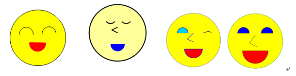

## Web-client : CSS3 실습

### Homework_css.html

날짜 : 2019/05/28

### smile.html

날짜 :2019/06/04

- 도형의 출력색과 모양은 원하는 대로 변경 가능하다.

- 위와 같은 형태이기만 하면 되며 사이즈와 출력 스타일은 일부 변경해도 무방하다.

- 파일명은 smile.html 로 작성하여 제출한다.