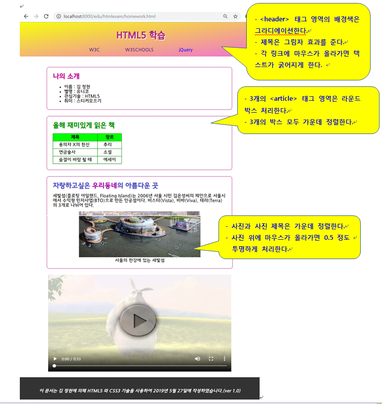

## Web-client : CSS3 실습.

### Homework_css.html

날짜 : 2019/05/28

### smile.html

날짜 :2019/06/04

- 도형의 출력색과 모양은 원하는 대로 변경 가능하다.

- 위와 같은 형태이기만 하면 되며 사이즈와 출력 스타일은 일부 변경해도 무방하다.

- 파일명은 smile.html 로 작성하여 제출한다.

### smilenew.html

날짜 : 2019/06/05

\- 다음 버튼 3개를 추가한다.

 저장하기, 삭제하기, 읽어오기

\- 저장하기 버튼이 클릭되면 <canvas> 태그 영역의 내용을 DataURL 형식으로 변환하여

로컬스토리지에 저장한다.

\- 삭제하기 버튼이 클릭되면 <canvas> 태그 영역의 내용을 삭제한다.

\- 읽어오기 버튼이 클릭되면 <canvas> 태그영역에 로컬스토리지에 저장된 DataURL 형식의 내용을 읽어와서 drawImage 한다.