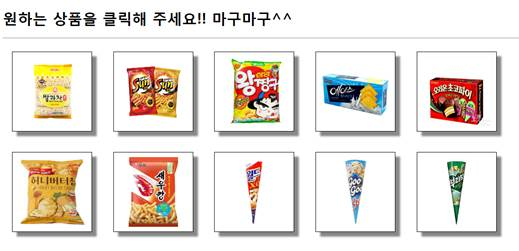

## Servlet&Jsp - Basket 실습

## productLog.html

날짜 : 2019 / 06 / 14

(1) 원하는 상품 이미지를 10개 준비한다. 

다음 상품 화면 처럼 만든다. 각각의 상품 이미지에 보더를 그리고 

그림자 효과도 설정한다. 상품이 클릭되면 pid=p001 ~ pid=p010 까지의 

쿼리 문자열을 가지고 BasketServlet을 요청(<a>태그 사용)하도록 구현한다.

 

 

(2) 다음 사양의 서블릿을 구현한다.

 

구현 클래스명 : core.BasketServlet

요청방식 : <a> 태그를 통해서 요청받는 서블릿을 구현하려면 어떤 요청 

방식이어야 할까요?

매핑명 : /basket

 

상품이 클릭될 때마다 선택된 상품의 ID 를 전달하면서 core.BasketServlet을 요청한다. 상품 ID 를 추출한 후에 다음과 같이 출력한다.

> 선택한 상품 : 상품 ID
>
> :
>
> 상품 선택화면으로 가기 

 

(3) 제출 파일 : productlog.html, BasketServlet.java

## productLog1.html

날짜 : 2019 / 06 / 17

클래스명 : core.BasketServlet1

URL 매핑명 : /basket1

요청방식 : GET

구현기능 : 상품이 선택되면 상품 ID를 서버에 전송하면서 core. BasketServlet1

을 Ajax 기술을 이용하여 요청한다. (상품ID는 p001~p01x 로 정한다.)

선택된 상품 정보를 로그 파일에 저장하고 응답은 JSON 형식으로 처리한다.

C:/logtest 폴더가 존재하지 않으면 생성하며

C:/logtest 폴더에 mylog.txt 를 만들고 다음 형식으로 요청 시마다 

행 단위로 저장한다.

>  201808191050 p002
>
> 201808201452 p003 
>
> 201808201455 p007
>
> ​           :

제출 : productlog1.html, core. BasketServlet1 

 

[ HTML 에서 구현할 내용 ]

(1) 이미지가 클릭되면 함수를 호출하게 클릭 이벤트 핸들러를 등록한다.

(2) 호출된 함수에서는 Ajax 기술을 사용해서 선택된 상품의 ID 를 전달하면서 BasketServlet1을

GET 방식으로 요청한다.

(3) 서버에서 응답된 JSON 형식{ “pid”, “p003”}의 내용에서 상품 ID를 추출하여 페이지에 출력한다.

 

[ 서블릿에서 구현할 내용 ]

(1) GET 방식 서블릿

(2) pid라는 이름으로 Query를 추출한다.

(3) 로그파일을 오픈하여 추출된 pid 정보를 년월일시분 정보와 함께 출력한다.(출력형식 참조)

(4) JSON 형식으로 전달된 상품 정보를 응답한다.  

   { “pid”, “p003”} 이런 형식으로.

 

  Ajax 요청 : Ajax 시간에 다뤘던 소스 참조

  JSON 형식의 응답 : ResponseServlet.java 소스 참조

 

## productlog2.html

날짜 : 2019/06 /17

 productlog.html 을 복사하여 productlog2.html 를 생성한다.

위의 상품 화면을 가지고 구현한다.

 

구현 클래스명 : core.BasketServlet2

요청방식 : GET

매핑명 : /basket2

상품이 클릭될 때마다 선택된 상품의 ID 를 전달하면서 core.BasketServlet2를 요청한다. 상품 ID 를 추출한 후에 다음과 같이 출력한다. 상품을 선택하여 요청할 때마다 이전에 선택했던 상품 정보가 유지되어야 한다. 다음과 같이 결과를 출력한다.

 

> 선택한 상품 리스트
>
> \------------------------------------------  
>
> l xxxx 상품 3개
>
> l xxxx 상품 1개
>
> l xxxx 상품 2개
>
>    :
>
>    상품선택화면  상품비우기

 

상품비우기를 클릭하면 core.BasketServlet2를 요청하는데 이 때는 세션객체에 보관되어 있던 상품 정보를 삭제한 후 브라우저로 상품이 모두 삭제되었다는 메시지를 출력하고 상품선택화면 링크를 출력한다.

(힌트, 10개의 원소를 가지는 int 타입의 배열을 생성하여 session 객체에 보관하고 선택된 상품의 개수를 저장한다.)

 

